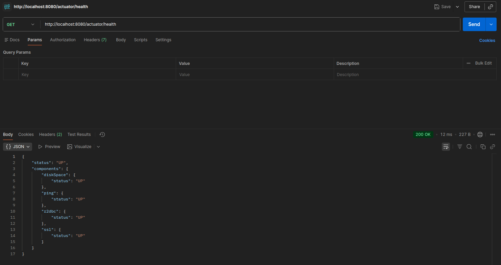
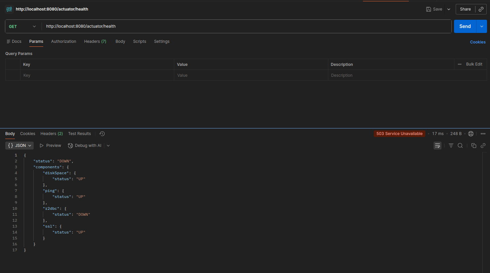

# Payment Service Provider (PSP)

This repository contains a simple implementation of a Payment Service Provider (PSP) using Java and Spring Boot. The PSP simulates receiving the transaction request and mock the processing.
Project demonstrates the use of Spring WebFlux for reactive programming, Lombok for boilerplate code reduction, and Jakarta Validation for input validation.
The architecture is designed with DDD principles in mind, separating concerns into different layers.

### Stack
- Java 21
- Spring Boot 3.5.6
- Gradle 8.14.3
- Spring WebFlux
- Lombok
- Jakarta Validation

### Additional Technologies:
- ECS logging
- Graceful Shutdown
- Actuator health check
- env setup
- liquibase for migrations

#### Examle of ECS logging:

```
{"@timestamp":"2026-02-13T12:40:41.248345107Z","log":{"level":"INFO","logger":"org.springframework.boot.web.embedded.netty.NettyWebServer"},"process":{"pid":84281,"thread":{"name":"restartedMain"}},"service":{"name":"psp","node":{}},"message":"Netty started on port 8080 (http)","ecs":{"version":"8.11"}}
{"@timestamp":"2026-02-13T12:40:41.271458437Z","log":{"level":"INFO","logger":"com.example.psp.PspApplication"},"process":{"pid":84281,"thread":{"name":"restartedMain"}},"service":{"name":"psp","node":{}},"message":"Started PspApplication in 7.782 seconds (process running for 9.045)","ecs":{"version":"8.11"}}
```

#### Example of Graceful Shutdown:
```
{"@timestamp":"2026-02-13T12:46:11.073681489Z","log":{"level":"INFO","logger":"org.springframework.boot.web.embedded.netty.GracefulShutdown"},"process":{"pid":84281,"thread":{"name":"SpringApplicationShutdownHook"}},"service":{"name":"psp","node":{}},"message":"Commencing graceful shutdown. Waiting for active requests to complete","ecs":{"version":"8.11"}}
{"@timestamp":"2026-02-13T12:46:11.077296425Z","log":{"level":"INFO","logger":"org.springframework.boot.web.embedded.netty.GracefulShutdown"},"process":{"pid":84281,"thread":{"name":"netty-shutdown"}},"service":{"name":"psp","node":{}},"message":"Graceful shutdown complete","ecs":{"version":"8.11"}}

Process finished with exit code 143 (interrupted by signal 15:SIGTERM)
```

#### Health Check
Health check is available at GET: /actuator/health

Example of UP status:


Example of DOWN status:



#### Environment
For env setup you need to create .env file. The example is shown in the .env.example file

```
DB_HOST=localhost
DB_NAME=transaction_db
DB_PORT=5432
DB_PASSWORD=postgres
DB_USERNAME=postgres
```

If env file will be absent, the app will fallback to default params declared in application.properties

#### Migrations
All migrations are controlled by Liquibase. To add new migration you need to create new changeset and add it to changelog-master

### Why this design
- Separation of concerns: domain core doesn’t depend on frameworks; adapters plug in later.
- Testability: time is injected via Clock, value objects validate invariants on creation, and ports allow mocking.
- Evolvability: adding new acquirers or switching persistence does not change the domain core.
- Reactive: using WebFlux allows handling many concurrent requests efficiently.
- Validation: Jakarta Validation ensures input data integrity.
- Lombok: reduces boilerplate code for data classes.
- JUnit, Mockito and Reactor Test: comprehensive testing of components.

### Architecture
- Hexagonal principles
    - Ports: domain-driven interfaces exposing functionality (TransactionService, Acquirer, AcquirerRouter, TransactionRepository)
    - Adapters: implementations of ports (TransactionServiceImpl, AcquirerA and AcquirerB, AcquirerRouterImpl, InMemoryTransactionRepository)
- Domain-Driven-Design (DDD)
    - Entities: core business objects with identity (Transaction)
    - Value Objects: immutable objects representing concepts (Money, CardDetails, StoredCardInfo)
    - enums: fixed sets of constants (TransactionStatus, AcquirerType, AcquirerDecision)
- WebFlux
    - Functional routing: defining routes using RouterFunction (TransactionRouterFunction)
    - Reactive handlers: handling requests reactively (TransactionHandler)
    - Reactive types: using Mono and Flux for async processing
    - exception handling: centralized error handling (GlobalExceptionHandler, GlobalErrorAttributes)
- Patterns used:
    - Factory/static initializers enforce invariants (Transaction.initialize, StoredCardInfo.of)
    - Builder using Lombok on top of value objects (Money, CardDetails) and application objects (PaymentRequest, PaymentResponse)
    - Factory class for acquirer selection (AcquirerRouter)
    - Strategy pattern for acquirer implementations (AcquirerA, AcquirerB)
    - Dependency Injection via Spring for wiring components together
    - Repository pattern for data access abstraction (TransactionRepository)

#### Running the Application
1. Ensure you have Docker and Docker Compose installed.
2. Clone the repository
3. Navigate to the project directory.
4. Setup database using Docker Compose:
   ```bash
   docker compose up -d
   ```
5. Run application with console or your IDE
  ```bash
  ./gradlew bootRun
  ```
6. The application will be accessible at `http://localhost:8080`.
7. See `http://localhost:8080/swagger-ui.html` for API documentation


